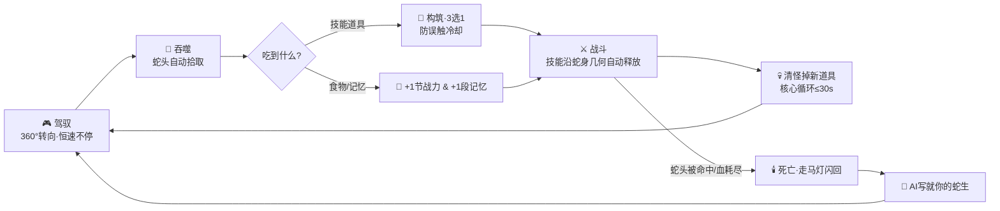
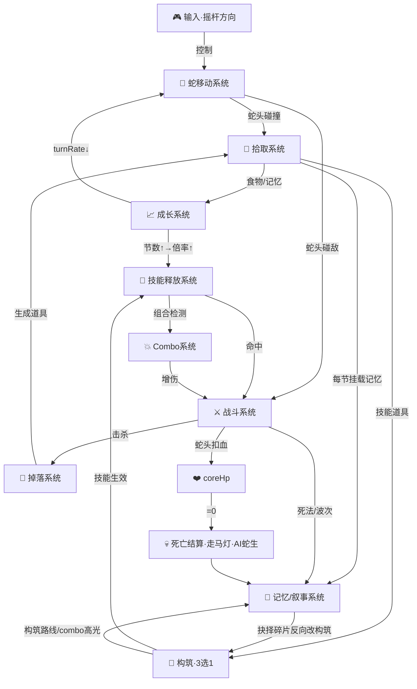
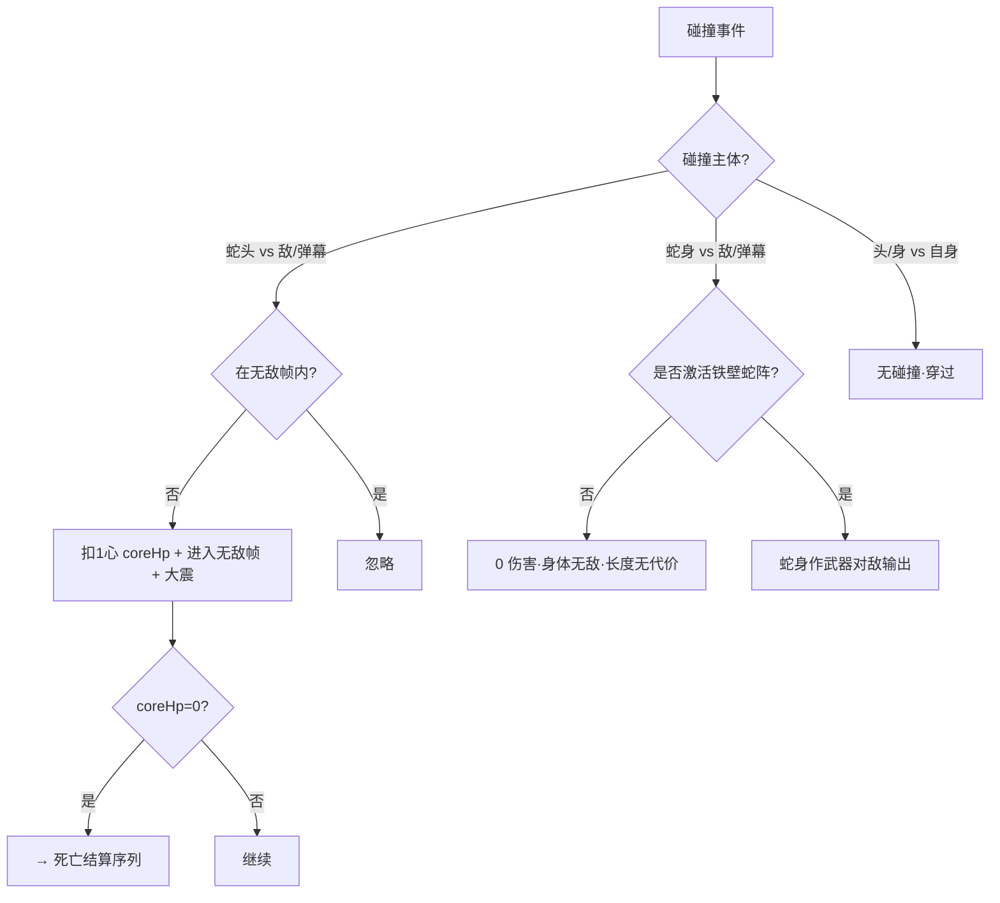
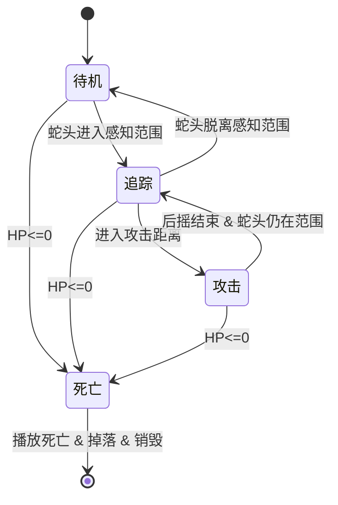
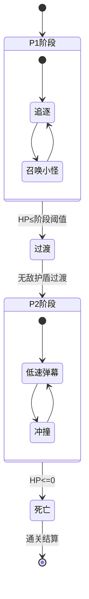
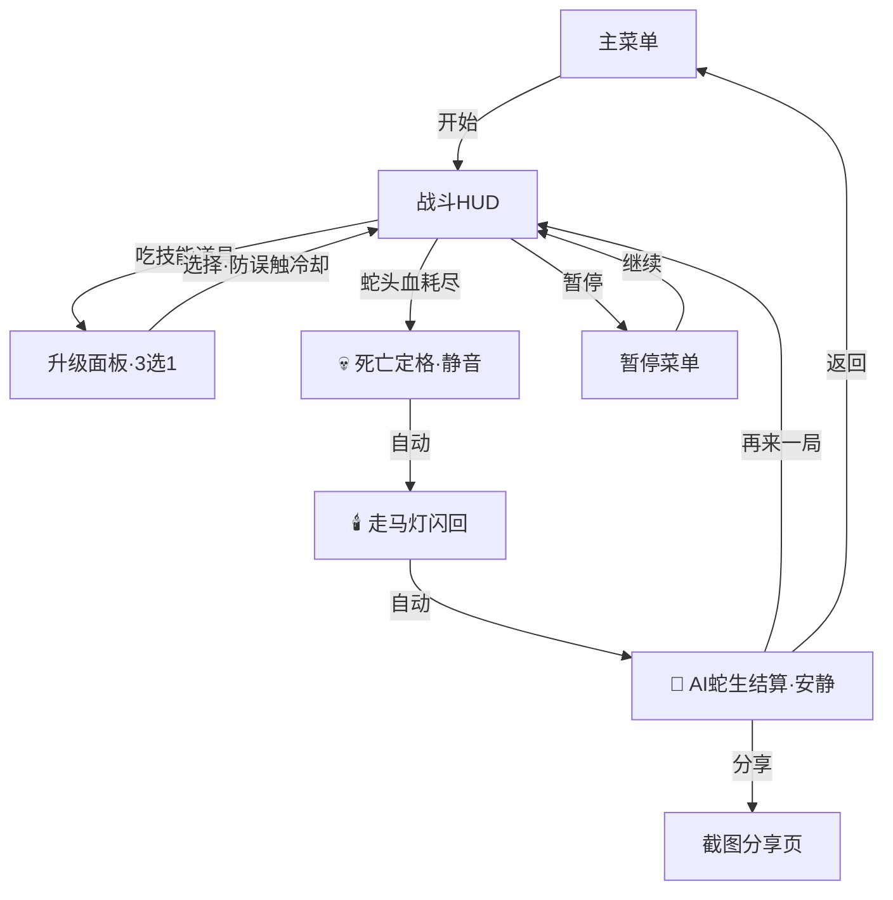

# 《此生为蛇》｜5.5 好玩基因融合版 · 全量 GDD v0.3 · 设计意图层（数值已分离）

<aside>
📘

**Layer 3 · 设计意图层（v0.3）** — 本文档只描述功能、机制与行为契约，**不含具体 gameplay 数值**（除 §0.2 硬常量白名单）。所有 gameplay 数值已迁出至 [《此生为蛇》｜5.5 好玩基因融合版 · 数值策划文档（数值真理源 v0.3）](https://app.notion.com/p/5-5-v0-3-96a2f9cc4a5541f19cffbc7ae0afdfb4?pvs=21)。

**前置**：[5.5 好玩基因融合版 · 定位一页纸（Pitch）｜方案A：一条蛇的一生](https://app.notion.com/p/5-5-Pitch-A-240f694ab5894db4a712077e33a9b7ab?pvs=21) + [5.5 好玩基因融合版 · 核心设计文档（Core Design）｜方案A：一条蛇的一生](https://app.notion.com/p/5-5-Core-Design-A-b0a6f9e372fb42718b1510ccd3766bb8?pvs=21)。结构对标 [SnakeRogue 全量 GDD v2.0 · 设计意图层（数值已迁移）](https://app.notion.com/p/SnakeRogue-GDD-v2-0-f395ea6a18c8402581fe0c94da67ccd0?pvs=21)。

**铁律**：① 每个机制有明确行为定义；② 每个 gameplay 数字一律引用数值真理源对应表，不在本文档直填；③ 酷但不服务任何体验目标的机制——砍掉。

</aside>

## §0 · 文档分工与硬常量白名单

### §0.1 三层分离声明

本文档（GDD）= **设计意图层**，描述「怎么玩、为什么这样设计、各系统如何接线」。所有「多少 / 多大 / 多频繁」类 gameplay 数值已迁至 [《此生为蛇》｜5.5 好玩基因融合版 · 数值策划文档（数值真理源 v0.3）](https://app.notion.com/p/5-5-v0-3-96a2f9cc4a5541f19cffbc7ae0afdfb4?pvs=21)；代码 `config.js` 从数值真理源同步。GDD 引用数值时只写「详见数值表 §X」，绝不直填裸数字。

### §0.2 硬常量白名单（GDD 内唯一允许出现的裸数字）

| **常量** | **值** | **性质** |
| --- | --- | --- |
| 蛇头生命 coreHp | 3 心 | 设计柱石（唯一命门） |
| 初始节数 | 3 节 | 设计柱石（effect 倍率基准） |
| 技能槽数 / 等级上限 | 5 槽 / Lv5 | 设计柱石（构筑结构） |
| 升级选项数 | 3 选 1 | 设计柱石（可变奖赏） |
| 食物增节 | +1 节 / +1 段记忆 | 基因级约定 |
| 蛇身最大节数 | 25 节封顶 | 设计柱石（倍率上限） |
| Broken Combo 总数 | 5（MVP ≥2-3） | 设计柱石（涌现内容） |
| 目标帧率 / 输入延迟上限 | 60 fps / ≤50 ms | 技术·操控红线 |
| 核心循环上限 / 新手保护期 / 致死保护 | 30 s / 30 s ramp / 30 s 不可死亡（🔴6 裁定）
派生：§9 新手引导节拍 0-10s / 10-30s / 30-60s / 1-3min 均为本行 30s 保护期的派生子档声明，非独立 gameplay 调参量 | 循环·难度红线 |
| 单局时长目标 | 5–8 分钟（不硬锁计时） | 体验 KPI（非平衡数值） |
| 结算「静」段上限 | 20 s | 体验 KPI（反多巴胺真空） |
| effect 倍率公式系数 / 基准 | 0.08 / 3 节 | 柱石公式锚点 |

<aside>
🎨

**资产豁免**：美术尺寸、配色十六进制、音频时长、UI 像素坐标、**叙事文案规格（AI 蛇生短文 80–120 字、模板骨架 ≥12 段等字数 / 数量规格）**等「资产规格」不属于 gameplay 数值，可在 §5/§10/§11/附录C 直接出现，不受 N-01 裸数字红线约束。

</aside>

<aside>
⚖️

**§0.2b 红线裁定（4.3 自检清单冲突项的正式定稿）**

- **🔴6 前 60 秒不可死亡 ↔ 30s 保护期**：裁定**致死保护期维持 30s**（真理源 §6.1）——前 30s 内蛇头 coreHp 不归零（最低保 1 心），覆盖新手操控与构筑教学期。自检清单 🔴6 字面要求 60s，本作正式裁定**收紧为 30s 并豁免**：60s 过久会把「首次死亡→AI 结局」这一核心 WOW 推得太晚、削弱留存钩子；30s 已足够完成教学，玩家首次真正的死亡（及 AI 结局揭示）在 30s 后即可触发。
- **🔴5 零文字引导**：本作以「半透明 overlay 微决策提示 + 首死揭示」实现，**无打断式弹窗教程**；裁定满足红线精神，列为豁免（overlay 提示 ≤1 行、可被操作打断、不暂停游戏）。
- **🔴17 数值表↔config 同步**：当前无代码暂挂；进代码后由真理源 §9 Changelog 纪律保证，复检转 ✅。
</aside>

### §0.3 文档信息

| **字段** | **填写** |
| --- | --- |
| **项目代号** | **《此生为蛇》**· 5.5 好玩基因融合版（原方案A：一条蛇的一生） |
| **文档版本** | v0.3 — 进代码设计冻结版（数值真理源 Boss 重算后封版，待原型回填） |
| **最后更新** | 2026-06-05 |
| **作者** | 胖胖（AI 辅助） |
| **读者分层** | **策划/制作人** → 全文；**程序** → §2-10、§13、§17 + 数值真理源；**美术** → §5、§11、附录C；**音频** → §11.3 |
- 📋 更新日志
    - **v0.1（2026-06-05）初稿**：依据定稿后的 5.5 核心设计文档逐节展开全量 GDD；三层分离（数值全迁出至数值真理源）；融合专属章节 §10 叙事与 AI 结算为 5.5 相对 5.2 的唯一增量价值。
    - **v0.2（2026-06-05）工程规格补全**：过 4.3 自检清单，补碰撞矩阵/敌人&Boss状态机/镜头死区/三重反馈表/波次要素表/屏幕清单/状态重置清单/技术规格/AI约束摘要/美术&音频规格；§0.2b 正式裁定 🔴5、🔴6、🔴17。
    - **v0.3（2026-06-05）进代码设计冻结**：联动数值真理源 Boss HP 重算（2000→17,500，自顶向下推导）封版；§13.4 增「结算静段 hardcap 20s」断言项；全文版本号对齐 v0.3。配套《原型实测回填清单》钉死悬空假设，原型跑通后强制回填。

---

## §1 · 项目概览（继承 Pitch / Core Design）

| **字段** | **填写** |
| --- | --- |
| **一句话概念** | 操控一条越吃越长、越长火力越猛的蛇，杀穿一关关怪潮去挑战终点 Boss；蛇头是唯一命门，每一次贪婪都可能让它丧命；无论功成身退还是功亏一篑，AI 都会把这趟旅程写成只属于你的「蛇生」。 |
| **品类公式** | 贪吃蛇 × 肉鸽割草（Survivor-like）× 关卡闯关 + AI 叙事结算 |
| **核心幻想** | 「越贪越强，越贪越险——一条蛇用贪婪闯关，也用贪婪写下自己的一生。」 |
| **张力轴** | 不是「越强越危险」，而是**「贪婪 → 更强 ＆ 更险」双向**：贪婪是玩家主动选择，一头通向变强/通关，一头通向送命/功亏一篑。 |
| **核心情绪** | 主：掌控 / 爽快（过程）· 副：贪婪 + 情绪落差「爽→静」（结局的怅惘→释然） |
| **四根设计柱石** | #1 蛇身即一切 · #2 死亡即故事 · #3 过程爽·结局静 · #4 手感是入场券 |
| **目标平台/受众** | Web（HTML5 Canvas）· 单一 360° 转向输入 · 轻中度割草+叙事玩家 + 心动 AI 岗评审 |
| **硬限制** | HTML5 Canvas+原生 JS · 1 人+AI 辅助 · 仅 1 种输入 |
| **成功定义** | 底线：三模块（5.2 骨架+5.4 手感+5.3 AI 结算）接线跑通、单局完整且核心循环好玩 · 达标：≥2 试玩者主动重开「想看 AI 写啥/想试别的搭配」 · 理想：成为作品集旗舰 Demo |

---

## §2 · 核心循环规格

<aside>
📌

两层循环：**秒级战斗循环**（多巴胺发生器，继承 5.2）+ **Session 级循环**（死亡→AI 结算→再来一局，回味发生器，继承 5.3）。所有数值见 [《此生为蛇》｜5.5 好玩基因融合版 · 数值策划文档（数值真理源 v0.3）](https://app.notion.com/p/5-5-v0-3-96a2f9cc4a5541f19cffbc7ae0afdfb4?pvs=21)。

</aside>

### 2.1 循环流程图（行为契约）



<aside>
📊

蛇速/转向/间距/effect 倍率 → [《此生为蛇》｜5.5 好玩基因融合版 · 数值策划文档（数值真理源 v0.3）](https://app.notion.com/p/5-5-v0-3-96a2f9cc4a5541f19cffbc7ae0afdfb4?pvs=21)；掉率 → §5 Pickup；致死/反馈 → §2 Combat Rules。

</aside>

### 2.2 循环步骤行为规格

| **步骤** | **玩家行为** | **系统行为契约** | **正反馈** | **负反馈/张力** |
| --- | --- | --- | --- | --- |
| ① 驾驭 | 360° 控蛇头朝向，蛇恒速不停 | 蛇沿方向前进，转向角速度随节数微衰减；自身碰撞关闭（穿过） | 甩尾绳感物理反馈 | 为找安全输出位的走位压力 |
| ② 吞噬 | 蛇头碰道具自动拾取 | 磁吸+1 节战力 ＆ +1 段记忆 token（同一资源同一动作） | 伸长+该节记忆微光+「+1」 | — |
| ③ 构筑 | 吃技能道具→3 选 1；偶发不可逆抉择 | 短暂暂停→面板滑入→防误触冷却→技能装到蛇身 | 新技能立即生效 | 3 个都不想要的纠结/不可逆的重量 |
| ④ 战斗 | 走位围杀，技能自动释放 | 技能沿蛇身节点几何铺开；命中触发 Hit Stop+飘字；检测 combo | 满屏割草爽感 | 蛇头暴露=扣 coreHp |
| ⑤ 死亡→结算 | 看走马灯+AI 蛇生 | 喧闹静音→定格→记忆图标逐节点亮→AI 80-120 字结局 | 怅惘后的释然（情绪最高峰） | 一切归零的揪心（全局唯一真空） |

<aside>
🔴

**循环红线**：核心循环 30s 内闭环 ✅；循环含「有意义选择」（3 选 1 + 走位）✅；≥1 可变奖赏节点（3 选 1 随机 + AI 结局随机=双重可变奖赏）✅。

</aside>

---

## §3 · 操控与手感（行为契约）

<aside>
🕹️

**操控范式已锁，不得模糊**：360° 自由转向蛇（[Slither.io](http://Slither.io) / SNKRX 谱系），蛇恒速前进、永不停，摇杆/滑动只控蛇头朝向；**直行撞自身=穿过，安全**。手感参数全部见 [《此生为蛇》｜5.5 好玩基因融合版 · 数值策划文档（数值真理源 v0.3）](https://app.notion.com/p/5-5-v0-3-96a2f9cc4a5541f19cffbc7ae0afdfb4?pvs=21)（turnRate 为原型阶段死磕项）。

</aside>

### 3.1 操控范式契约

| **字段** | **行为定义** |
| --- | --- |
| **选定范式** | 360° 自由转向蛇。**非**松手停模式；**非** 5.3 直角网格离散步进。 |
| **核心输入** | 虚拟摇杆/滑动 = 控蛇头朝向（仅 1 种）。技能全自动释放，玩家不手动施放。 |
| **无输入行为** | 蛇沿当前方向匀速直行——不停、不减速（唯一例外：贴墙刮擦期短暂减速，见 §3.2b / 真理源 §2.1，属环境交互非操控减速）。 |
| **自身碰撞** | 关闭（穿过）。硬裁决②，对应真理源 §2.1 第三行。 |

### 3.2 碰撞判定行为契约（三层解耦）

<aside>
⚠️

**身体无敌、头是唯一命门**：① 蛇头 vs 敌/弹幕=掉血（唯一致死来源）；② 蛇身 vs 敌/弹幕=不掉血、长度无代价（割草爽感前提；但蛇身仍可作主动撞击武器，见 §4.3 铁壁蛇阵）；③ 头/身 vs 自身=无碰撞穿过。具体伤害/无敌帧/接触伤害见 [《此生为蛇》｜5.5 好玩基因融合版 · 数值策划文档（数值真理源 v0.3）](https://app.notion.com/p/5-5-v0-3-96a2f9cc4a5541f19cffbc7ae0afdfb4?pvs=21)。

</aside>

### 3.2b 碰撞矩阵（D-04~D-09 规范格式）

| **A ↓ 碰 B →** | **敌人** | **敌弹幕** | **食物/记忆** | **技能道具** | **自身蛇体** |
| --- | --- | --- | --- | --- | --- |
| **蛇头** | 扣 1 心 + 无敌帧 + 大震（唯一致死源） | 扣 1 心 + 无敌帧（仅 Boss P2 有弹） | +1 节 & +1 段记忆（磁吸拾取） | 触发 3选1（防误触冷却） | —（无碰撞·穿过） |
| **蛇身节点** | 0 伤害·身体无敌（铁壁蛇阵激活时蛇身作武器输出） | 0 伤害·身体无敌（吸收弹幕，长度无代价） | 无交互（仅蛇头可拾取） | 无交互（仅蛇头可拾取） | —（无碰撞·穿过） |

<aside>
📐

对角线/自身列为「—（无碰撞·穿过）」（硬裁决②，弃用撞尾即死）；全部数值见 [《此生为蛇》｜5.5 好玩基因融合版 · 数值策划文档（数值真理源 v0.3）](https://app.notion.com/p/5-5-v0-3-96a2f9cc4a5541f19cffbc7ae0afdfb4?pvs=21) §2。

</aside>

<aside>
🧱

**墙 / 世界边界碰撞（§3.2b 补全·非伤害交互）**：蛇头 / 蛇身 vs 世界边界 ＝ **沿墙滑行（切向保速、不可穿越）＋接触期刮擦减速＋0 coreHp 伤害**，**非致死来源**（守唯一命门＋不冤死＋§5.1 边界＝中性环境 三红线）。墙的威胁是**位置性**的：贴墙＝自断退路→怪潮把蛇头逼向墙角被迫挨打（§8.2 贪婪悖论）。减速幅度 / grace 见真理源 §2.1，须保持蛇速 ＞ Boss 弹速以防减速性冤死。

</aside>

### 3.3 三重反馈契约（过程做满·结算转静）

过程中给足视觉+音频+触觉三重反馈；死亡结算段刻意收掉喧闹，把感官攒到走马灯一次性引爆。各事件反馈映射见核心设计 §3.3 与真理源 §2.2（hitStop/屏震/无敌帧数值）。

### 3.4 镜头与死区行为契约（C-04 / C-08）

| **项** | **行为定义** |
| --- | --- |
| **摇杆死区** | 死区半径内不改变蛇头朝向，防原地抖动与误触；deadZoneRadius 见真理源 §1。 |
| **镜头跟随** | 平滑跟随蛇头（lerp），朝行进方向前瞻偏移留出前方视野；蛇头进入镜头死区内不移镜。camera* 见真理源 §1。 |
| **缩放/视野** | 固定逻辑分辨率，蛇变长不拉远镜头（保持割草密度感）；分辨率策略见 §13.4。 |

### 3.5 三重反馈契约表（C-09 · 每操作 视觉+音频+触觉）

| **操作/事件** | **视觉** | **音频** | **触觉/震动** |
| --- | --- | --- | --- |
| 转向 | 蛇头朝向平滑插值 + 甩尾绳感 | —（避免噪音） | — |
| 吞噬 +1 节 | 伸长 + 节点微光 + 「+1」飘字 | ding | 极短轻震 |
| 技能命中 | Hit Stop + 伤害飘字 + 敌受击闪白 | 打击音 | 过程小屏震 |
| 3选1 升级 | 面板滑入 + 技能图标点亮 | 升级琶音 | 中震 |
| 蛇头受击扣心 | 红色屏闪 + 大震 + 无敌闪烁 | 受击警报音 | 受击大震 |
| 死亡 | 静音褪色定格 → 走马灯 | BGM 切断→回忆配乐 | 一次大震后归静 |

具体帧数/像素见真理源 §2.2。

### 3.6 🎨 5.4 手感基因继承（juice / 物理表现）

<aside>
🎨

**5.5 融合硬目标（柱石 #4 手感是入场券）**：5.4《活蛇》验证过的「灵动跟手 + 爆汁反馈」必须融进 5.5。手感 = 输入响应 × 物理模拟 × 反馈密度 三轴相乘；数值见真理源 §1（绳感/转向/镜头）与 §2.2–§2.3（打击/squash/拖尾/反馈分层）。

</aside>

| **基因（5.4 继承）** | **行为契约** | **数值/状态来源** |
| --- | --- | --- |
| 绳感跟随（灵动性核心） | 蛇身路径记录法跟随蛇头、节间距固定，高速转向甩尾顺滑 | followLerp / segmentSpacing（真理源 §1） |
| 转向手感人格 | 最大转向角速度随节数微衰减但有下限，越长略重而不失控 | turnRate / turnRateDecay / turnRateFloor（§1·P0） |
| squash / stretch 挤压拉伸 | 吞噬时蛇头瞬时挤压回弹；受击/死亡时形变 | squashEat / squashHitDeath（§2.3） |
| 拖尾 / 运动模糊 | 高速移动蛇身发光拖尾 + 轻微运动模糊，强化速度感 | trailLength / motionBlur（§2.3） |
| 反馈分层（防脱敏） | 轻击→过程→暴击·Combo→致命 四档递进强度，避免单一屏震长时间轰炸脱敏 | shakeLight→shakeProcess→shakeCrit→shakeDeath（§2.2） |
| 防冤死手感 | 蛇头被击不击退、命门判定宁小勿大、输入零延迟 | headKnockback=0 / headRadius / inputDelay（§1） |

<aside>
🔴

**juice 四原则（5.4 红线·实现期照搬·质检必查）**：① 即时（反馈零延迟）；② 夸张（数值变化必有超量演出）；③ 层叠（视觉+音频+触觉多通道同触发）；④ **不干扰**——蛇头 / 食物 / 敌人 / 边界永远一眼可读，特效再炸也不能盖核心信息。前三条做满爽感，第四条是「爽而不乱」底线，最易翻车。

</aside>

---

## §4 · 机制系统设计

### 4.0 系统连接图（防缝合怪的系统级证明）



**融合证明**：记忆/叙事系统（NARR）输入边=4（蛇身/构筑/战斗/死亡），且与构筑系统**双向**（战斗→叙事高光，叙事抉择→改构筑）——非孤岛，是真融合的系统级证据。蛇身是超级枢纽（连接 5），同时负载战力与记忆。

### 4.1 机制清单（行为契约）

| **机制** | **来源** | **行为契约** | **服务柱石** | **MVP?** |
| --- | --- | --- | --- | --- |
| 360° 蛇移动·不停·穿过自己 | 5.2+裁决 | 恒速前进只控方向，自撞穿过 | #1·#4 | ✅ |
| 技能 3 选 1 构筑 | 5.2 | 吃技能道具直接触发（非经验阈值） | #1 | ✅ |
| 技能自动从蛇身释放 | 5.2 | 沿蛇身节点几何铺开，玩家只走位 | #1·#4 | ✅ |
| 蛇身=技能平台+碰撞武器+血量缓冲 | 5.2 | 越长 effect 倍率越高（公式见真理源 §1.1） | #1 | ✅ |
| 🧬 蛇身节点=记忆载体 | 5.3×5.2 | 每节同时记 {吃了什么/发生了什么}，战力链=记忆链 | #1·#2 | ✅ |
| 战斗致死（蛇头命中/血耗尽）/关卡失败 | 裁决 | 死亡来源单一明确，不冤死 | #3 | ✅ |
| 🧬 死法=叙事输入 | 5.3 | 贪死/血耗尽/Boss前/通关→不同结局基调 | #2 | ✅ |
| 走马灯 + AI 结局短文 | 5.3 | 结算屏读取整条蛇履历→80-120 字 | #2·#3 | ✅ |
| 🧬 不可逆抉择（2选1） | 5.3 | 既是构筑决策又是人生岔路，不可逆；MVP 低频 | #2 | Alpha |
| 技能 combo 联动/围杀 | 5.2 | 特定技能组合触发质变效果 | #1 | ✅(2-3) |

<aside>
🧬

标 🧬 的四条为融合专属，**没有一条增加新核心操作**：记忆载体=蛇身属性叠加，死法=死亡事件分类，AI 结局=结算屏产出，2选1=复用 3选1 交互。融合=低成本高杠杆，把 5.3 第五台引擎（回味）接到 5.2 骨架上。

</aside>

### 4.2 升级感知层

蛇身长度效果公式沿用 5.2（**详见 [《此生为蛇》｜5.5 好玩基因融合版 · 数值策划文档（数值真理源 v0.3）](https://app.notion.com/p/5-5-v0-3-96a2f9cc4a5541f19cffbc7ae0afdfb4?pvs=21)**：`1+(节数−3)×0.08`）。数值变化必配套视觉+音效+文案。融合版加一条：节数越多，AI 结局可调用的记忆素材越丰富（一生越厚）。

### 4.3 Broken Combo（行为契约）

<aside>
📊

Combo 战斗效果数值与 MVP 范围 → [《此生为蛇》｜5.5 好玩基因融合版 · 数值策划文档（数值真理源 v0.3）](https://app.notion.com/p/5-5-v0-3-96a2f9cc4a5541f19cffbc7ae0afdfb4?pvs=21)。每个 combo 除战斗质变外，额外向 AI 结算贡献一段「高光时刻」叙事副产物。

</aside>

| **Combo** | **组合** | **战斗行为** | **叙事副产物（喂 AI）** |
| --- | --- | --- | --- |
| 🌋 蒸汽爆炸 | 火焰+冰冻 | 先冻后烤范围爆伤 | 「一次毁天灭地的高光」 |
| ⚡ 电磁炮台 | 弹射+闪电 | 子弹命中触发连锁闪电 | 「火力巅峰时刻」 |
| 🔥 灼烧弹幕 | 火焰+弹射 | 子弹附加灼烧 DOT | 「燃烧的进攻期」 |
| 🔰 铁壁蛇阵 | 护盾+蛇身碰撞 | 主动撞怪即最强输出 | 「以身犯险的莽撞期」 |
| ❄️ 冰冻围杀 | 冰冻+围杀 | 绕圈留冰、围圈冻杀 | 「精心布局的猎杀」 |

---

## §5 · 视觉语义规则

### 5.1 实体颜色语义

| **类别** | **颜色** | **符号原则** |
| --- | --- | --- |
| 有害（敌/弹幕） | 红/紫 | 攻击性（尖刺）+威胁圈 |
| 有益（技能/食物/记忆碎片） | 金/黄/绿 | 价值符号（宝石/星/记忆图标） |
| 中性（边界/障碍） | 灰/深蓝 | 环境性 |
| 玩家（蛇） | 鲜绿/青 | 圆润蛇头+发光节点 |

### 5.2 🧬 蛇身节点双重视觉（融合核心呈现）

<aside>
🧬

同一串节点：战斗中是「发光的技能释放点」（战力可视化，注意力在此），同时携带极淡的记忆图标（平时不干扰读图）；**死亡瞬间**战斗光效全褪，记忆图标从头到尾依次点亮=走马灯（一生可视化）。**视觉语言的切换本身就是「爽→静」的载体。**

</aside>

---

## §6 · Session 与关卡结构（5–8 分钟）

<aside>
🎢

**结构=关卡制 + roguelike 闯关（Hades 类）**：分关推进、终点 Boss 为目标，失败带新构筑/解锁重开。**不硬锁计时**，难度曲线把中位单局收敛在 5–8 分；长局用「叙事性终幕」优雅收口，绝不用计时器强杀。关卡段/怪潮密度/Boss 数值 → [《此生为蛇》｜5.5 好玩基因融合版 · 数值策划文档（数值真理源 v0.3）](https://app.notion.com/p/5-5-v0-3-96a2f9cc4a5541f19cffbc7ae0afdfb4?pvs=21)。

</aside>

### 6.1 情绪弧线（行为契约）

| **阶段** | **玩家在做什么** | **目标情绪** |
| --- | --- | --- |
| 开局/保护期 | 蛇短，新手保护期内拿首个技能 | 好奇+期待 |
| 成长·构筑 | 2-3 技能，combo 涌现 | 专注+渐强爽感 |
| 割草·心流 | 4-5 技能，满屏特效，围杀博弈 | 爽快+心流+贪婪 |
| 高潮·濒死 | 蛇超长、火力巅峰但难保命 | 肾上腺素+紧绷 |
| **死亡（骤停）** | 一切归零 | **揪心、失重（全局唯一真空）** |
| **结算（回味）** | 看走马灯+AI 蛇生 | **怅惘后的释然（情绪最高峰）** |

### 6.2 多巴胺节奏与反真空例外

过程段严守「每 30–60 秒一个爽点」；**结算段是有意的反多巴胺真空**（≤20s，靠失落感+回味而非多巴胺）。结算时间轴排布（走马灯逐节点亮+AI 短文如何在 ≤20s 内容纳）见 [《此生为蛇》｜5.5 好玩基因融合版 · 数值策划文档（数值真理源 v0.3）](https://app.notion.com/p/5-5-v0-3-96a2f9cc4a5541f19cffbc7ae0afdfb4?pvs=21)。

### 6.3 逐段要素引入表（F-02 / F-03 / F-04 / F-05）

| **关卡段** | **本段新引入要素（≤2）** | **波次 UI 反馈** |
| --- | --- | --- |
| ① 保护期 | 追踪怪、食物/记忆 | 段编号 + 操作 overlay 提示 |
| ② 成长 | 散步怪、冲锋怪（+技能道具掉落） | 击杀进度 + 新怪入场预警 |
| ③ 割草 | 精英怪、首个 Combo 机会 | Combo 发现高亮 + 段切换提示 |
| ④ 高潮 | 多精英、密集弹幕走位 | 密度升级提示 + Boss 临近预警 |
| ⑤ Boss | Boss 两阶段 | Boss 血条 + 阶段切换提示 |

<aside>
📊

段切换有安全间隔（waveSafeInterval）、Boss 出现前有预警（bossWarnLead），数值见真理源 §6.2。每段新增要素严格 ≤2（🔴8）。

</aside>

---

## §7 · 战斗系统（碰撞三层解耦·头号工程）

<aside>
📐

**Layer 3 头号工程之一**：碰撞三层解耦的状态机实现。蛇头、蛇身、自身三类碰撞走完全独立的处理分支，互不污染。

</aside>

### 7.1 碰撞处理分支（伪状态机）



### 7.2 死亡结算序列（行为契约）

死亡触发后：① 喧闹静音/褪色→定格（一次大震后归无）→ ② 走马灯逐节点亮 → ③ AI 蛇生短文浮现 →「再来一局」延迟出现。各段时长见 [《此生为蛇》｜5.5 好玩基因融合版 · 数值策划文档（数值真理源 v0.3）](https://app.notion.com/p/5-5-v0-3-96a2f9cc4a5541f19cffbc7ae0afdfb4?pvs=21)。敌人 AI（追踪/散步/冲锋/精英/Boss 两阶段）行为见核心设计 §4，数值见真理源 §3。

### 7.3 通用敌人状态机（E-01~E-07）



| **状态** | **行为** | **转换条件（量化）** |
| --- | --- | --- |
| 待机 | 原地/巡逻 | 感知范围见真理源 §3 |
| 追踪 | 朝蛇头移动（速度 ≤ 蛇速 80%） | 距离 < 攻击距离 → 攻击 |
| 攻击 | 近战碰撞（冲锋怪先 telegraph 蓄力） | 后摇时长见真理源 §3.1 |
| 死亡 | 播放死亡 + 概率掉落 | HP ≤ 0 |

### 7.4 Boss 状态机与教学性（E-07~E-09 / 🔴12）



<aside>
🎓

**Boss 教学性（🔴12）**：阶段1「追逐+召唤」教玩家**走位拉扯 + 清场维持输出位**（巩固秒级循环）；阶段2「低速弹幕+冲撞」教玩家**只用蛇头躲弹、用蛇身硬吃无伤**（强化「头是唯一命门、身无敌」核心认知）。Boss 不是血厚大怪，是这两课的毕业考。阶段阈值/弹速见真理源 §3.1。

</aside>

---

## §8 · 成长与经济系统

<aside>
🧬

**防缝合怪经济设计**：「食物/记忆碎片」是**同一资源、同一拾取动作**——吃一口，战力 +1 节，记忆链 +1 段。叙事资源没有独立获取循环，保证「玩战斗」与「攒一生」是同一件事的两面。资源源/汇/掉率 → [《此生为蛇》｜5.5 好玩基因融合版 · 数值策划文档（数值真理源 v0.3）](https://app.notion.com/p/5-5-v0-3-96a2f9cc4a5541f19cffbc7ae0afdfb4?pvs=21)。

</aside>

### 8.1 升级触发契约

3 选 1 由「吃到技能道具」直接触发（**非**经验阈值攒满）；食物/记忆碎片只 +1 节（战力+记忆），不触发升级。两条拾取流分开，避免节奏混乱。3选1 权重/保底/技能槽满后行为 → 真理源 §7。

### 8.2 核心矛盾：贪婪悖论

<aside>
🪤

变长本身几乎无代价（身体无敌、不减速）；真正的风险博弈是**贪婪**——为多吃一口/多撑一波/Boss 前抢补给，把唯一命门蛇头探进怪潮与弹幕。「再贪一点更强 vs 见好就收保命」是全程纠结，决定这条蛇走多远、死得多遗憾。补给刻意刷在危险区（调参锚点见 [《此生为蛇》｜5.5 好玩基因融合版 · 数值策划文档（数值真理源 v0.3）](https://app.notion.com/p/5-5-v0-3-96a2f9cc4a5541f19cffbc7ae0afdfb4?pvs=21)），把贪婪直接转化为叙事张力。

</aside>

### 8.3 Meta 成长（横向解锁）

<aside>
🔓

**只做横向解锁**（新蛇种/新技能入池/新道具池/新事件岔路/记忆库扩充，扩展「可能性空间」，下一局起点战力不变），**拒绝纵向数值碾压**（不做永久 +攻击/+血量）。理由：纵向破坏「每条蛇都是平等的一生」的叙事前提，且易用数值掩盖核心循环是否好玩。**红线**：MVP 阶段横向也不做满——Meta 是留存层，过早加会污染对核心循环的判断。

</aside>

### 8.4 计分与战绩（过程战绩契约）

<aside>
🏆

**得分 ＝ 过程「割草战绩」，不是情感落点。** 击杀累计得分（按敌人威胁度计基础分 × 连杀倍率）＋ Combo 首次发现分，构成结算屏「割草战绩」截图钩子之一（另一为 AI 蛇生短文，见 §11.2）；计分公式与基础分值见 [《此生为蛇》｜5.5 好玩基因融合版 · 数值策划文档（数值真理源 v0.3）](https://app.notion.com/p/5-5-v0-3-96a2f9cc4a5541f19cffbc7ae0afdfb4?pvs=21) §7。

**🔴 红线**：① 得分仅过程战绩，**情感落点是 §10 AI 蛇生而非分数 / 评级**；② 得分**不得侵占「静」段**——走马灯 ＋ AI 短文期间禁止分数滚动 / 排行榜抢戏（§6.2 反真空、静段 ≤20s）；③ 连杀倍率在蛇头扣心时重置（奖励无伤清场），但不得演化成「不去通关、原地刷分」；④ 单局战绩**不转永久数值加成**（§8.3 拒纵向碾压）。

</aside>

---

## §9 · 新手引导（前 5 分钟）

<aside>
💡

**特殊挑战**：既要教战斗，又不能剧透/打断叙事。**解法：过程只教战斗，叙事在玩家首次死亡时「惊喜揭示」**——第一次死时 AI 结局突然把刚才那局写成一段蛇生，这个「原来还有这一层」是说服玩家「这游戏不一样」的唯一窗口，绝不在新手期提前剧透。

</aside>

引导节拍：① 0-10s 教 360° 移动；② 10-30s 教吃东西变长；③ 30-60s 教技能构筑+自动攻击；④ 1-3min 完整割草循环（可跳）；⑤ **首次死亡→首次走马灯+AI 结局（留存关键 wow）**。新手保护期数值 → [《此生为蛇》｜5.5 好玩基因融合版 · 数值策划文档（数值真理源 v0.3）](https://app.notion.com/p/5-5-v0-3-96a2f9cc4a5541f19cffbc7ae0afdfb4?pvs=21)。

<aside>
📐

注：本作新手引导以「半透明 overlay 决策提示」实现（非纯零文字），覆盖自检清单「零文字引导」项；「致死保护期」由真理源 §6.1 实现（裁定为 30s，见 §0.2b），但首次死亡用于揭示 AI 结局，故新手期不剧透叙事内容。

</aside>

---

## §10 · 🧬 叙事与 AI 结算系统（融合核心·5.5 唯一增量价值）

<aside>
📜

这是 5.5 相对 5.2 的**唯一增量价值**。叙事不是叠加的第二套玩法，而是**战斗数据的二次利用**：你吃了什么（吞噬）、选了什么（构筑）、怎么走位被怎么打死（驾驭），这三条数据流天然就是一份「人生履历」，AI 在死亡时读取它。数值（死法×基调矩阵/记忆 token/抉择频率/AI 变量）→ [《此生为蛇》｜5.5 好玩基因融合版 · 数值策划文档（数值真理源 v0.3）](https://app.notion.com/p/5-5-v0-3-96a2f9cc4a5541f19cffbc7ae0afdfb4?pvs=21)。

</aside>

### 10.1 数据结构契约：蛇身节点双重意义

每个蛇身节点同时携带 `\{战力属性, 技能槽, 记忆 token\}`。记忆 token 记录该节拾取/事件的 {吃了什么、第几关、发生了什么高光}，是走马灯逐节点亮与 AI 结算的素材源（结构见真理源 §8.2 memoryTokens）。

### 10.2 AI 结算管线（档2 模板触发式·MVP）


<aside>
🔴

**MVP 必须含 AI 结局**。用档2「固定模板触发式」：按死法/构筑/波次命中条件→拼接填空，纯规则、零延迟、零成本、demo 100% 稳定可复现。**模板量红线**：≥4 死法×3 构筑倾向=12 段骨架+变量填空，保证前 10 局基本不重样。**架构预留档3「生成式 AI」接口**（档2 模板兼作 AI 范例与保底兜底，叠加而非重做），档3 放 Alpha。档1（不做叙事）否决=砍掉 5.5 灵魂。

</aside>

<aside>
🕯️

**首测前必跑通（用户裁定）**：死亡→剧情**不延后、不依赖 AI**。档2 模板文案库已实体化落定于数值真理源 §8.6（走马灯逐节点文案池）、§8.7（12 骨架蛇生短文模板＋变量字典＋分类兜底）、§8.8（不可逆抉择事件库）、§8.9（结算战绩九项）。代码用纯查表拼接即可让「死亡定格→走马灯→蛇生短文」完整跑通并通过质检；接 AI（档3）是后续增强，非首测前置。叙事文案属 §0.2 资产豁免，全部维护在真理源 §8、不入 GDD 正文。

</aside>

### 10.3 走马灯（死亡闪回）

死亡瞬间战斗光效全褪，蛇身记忆图标从头到尾依次点亮，配乐切回忆向；与蛇生短文共同构成结算「静」段（≤20s，节奏见真理源 §8.4）。走马灯逐节点文案池（生命阶段池＋里程碑事件特写行＋拼装规则）见真理源 §8.6。

### 10.4 不可逆抉择（2选1 人生节点）

既是战斗构筑决策、又是人生岔路，**不可逆**（可逆=没重量，回味引擎废）。MVP 低频（稀有=庄重；频率见真理源 §8.3），验证有正反馈后评估升频；抉择碎片**反向影响构筑**（叙事→战斗回路，是融合成立的关键边）。频率/可逆性 → 真理源 §8.3；事件文案库（情境/A·B 选项/构筑后果/人生记忆标签/默认分支）见真理源 §8.8。

---

## §11 · UI/UX 与表现

### 11.1 UI 状态流转（核心是「爽→静」转场）



### 11.2 HUD 要素

战斗 HUD：coreHp（心）、当前节数/effect 倍率提示、已装技能与等级、关卡进度/Boss 血条。结算屏：死亡定格 → 走马灯画布（逐节点记忆文案，真理源 §8.6）→ 蛇生短文（无 AI 时用档2 模板库，真理源 §8.7；接 AI 后增强）→ 战绩九项卡（割草战绩截图钩子，真理源 §8.9，从属蛇生短文不抢戏）；双截图钩子＝割草战绩 / 蛇生短文。

### 11.3 音频设计意图

过程：打击音/升级琶音/combo 和弦，密集反馈；**死亡：BGM 切断→留白→回忆配乐**，用静默落差承载「爽→静」。具体音频资产规格属资产豁免，列入附录C。

### 11.4 屏幕清单（H-02 · 转入/转出条件）

| **屏幕** | **转入条件** | **转出条件** |
| --- | --- | --- |
| 主菜单 | 启动 / 结算返回 | 点「开始」→ 战斗 HUD |
| 战斗 HUD | 开始 / 升级面板关闭 / 暂停继续 | 吃技能道具→升级面板；coreHp=0→死亡定格；点暂停 |
| 升级面板·3选1 | 吃到技能道具 | 选择 + 防误触冷却（buildPauseCD，见真理源 §1）→战斗 HUD |
| 死亡定格→走马灯→AI 结算 | coreHp=0 | 「再来一局」（延迟出现）/ 分享 / 返回 |
| 暂停菜单 | 点暂停 | 继续→HUD / 退出→主菜单 |

### 11.5 防误触与触控反馈（H-03 / H-09 / H-11 / H-12）

- **3选1 / 再来一局**：均带防误触冷却（buildPauseCD，见真理源 §1），按钮间距留足、远离摇杆区。
- **暂停按钮**：置于右上极角，远离左下摇杆操作区。
- **虚拟摇杆**：触摸后变不透明 + 显示方向指示；松手蛇沿当前方向直行（§3.1）。

---

## §12 · 系统连接自检

继承核心设计 §12 结论：叙事系统连接数=4 且与战斗**双向**（战斗→叙事高光，叙事抉择→改构筑），非孤岛；蛇身为超级枢纽（连接 5），同时负载战力与记忆。**融合系统级成立**。连接强度矩阵见核心设计 §12.2。

---

## §13 · 技术架构

<aside>
⚙️

HTML5 Canvas + 原生 JS，移动端 Web，单人 + AI 辅助开发。无硬编码魔法数字——所有 gameplay 常量从 [《此生为蛇》｜5.5 好玩基因融合版 · 数值策划文档（数值真理源 v0.3）](https://app.notion.com/p/5-5-v0-3-96a2f9cc4a5541f19cffbc7ae0afdfb4?pvs=21)导出的 `config.js` 读取。

</aside>

### 13.1 三大头号工程（留给实现）

| **工程** | **要点** | **对应** |
| --- | --- | --- |
| ① 碰撞三层解耦状态机 | 蛇头/蛇身/自身三分支独立处理（§7.1） | 真理源 §2 |
| ② 蛇身节点双重意义数据结构 | 每节 {战力属性, 技能槽, 记忆 token}（§10.1） | 真理源 §8.2 |
| ③ AI 结算 Prompt/模板工程 | 输入=构筑序列+combo高光+死法+波次→输出 80-120 字，含「模板保底→生成式」降级（§10.2） | 真理源 §8 |

### 13.2 模块解耦

蛇移动 / 战斗 / 拾取 / 构筑 / Combo / 叙事-AI / 关卡-波次 / UI 各为独立模块，通过事件总线通信（对应 §4.0 连接图的边）。叙事-AI 模块为只读消费者+单条回路（抉择→构筑），不污染战斗主循环性能（60fps 红线）。

### 13.3 状态重置清单（J-03 / L-07 · 肉鸽重开必清）

<aside>
♻️

每次「再来一局」必须由单一 `resetRun()` 复位以下，漏一项即出 bug（上局残留）：

</aside>

- 蛇：节数→initSegments、coreHp→满、位置/朝向→出生点、turnRate→基准
- 构筑：技能槽清空、技能等级归零、已触发 Combo 清空
- 场景：敌人/弹幕/掉落物全部回收入对象池、波次计时→0、关卡段→①
- 叙事：memoryTokens 清空、buildSequence/comboHighlights/deathCause/irreversibleChoices 清空
- UI/计分：HUD 重置、连杀倍率→1.0、本局分→0、新手保护计时→0

### 13.4 技术规格（J-02 / J-04 / J-05 / J-06 / J-08）

| **项** | **方案** |
| --- | --- |
| 对象池 | 敌人 / 子弹 / 粒子 / 掉落物 / 飘字全部池化预分配，禁运行时频繁 new（保 60fps） |
| 碰撞检测 | 圆形碰撞体 + 空间网格分区；蛇头仅与敌/弹/道具测，蛇身仅吸收 |
| 本地存储 | localStorage 存横向解锁项 / 历史最佳 / 最近若干条 AI 蛇生；JSON 格式；P2 扩展云存 |
| 分辨率策略 | 固定逻辑分辨率 + 等比缩放适配 + 安全区；移动端锁定一种朝向 |
| 稳定性标准 | 连续 5 局无崩溃 / 无内存泄漏（对象池回收计数闭合） |
| 结算静段 hardcap | 总静段（定格 + 走马灯 + AI 短文）硬上限 **20s** 断言；超出**自动压缩走马灯**（不压 AI 短文，保叙事完整）；对应真理源 §8.4 时间轴 |

---

## §14 · 开发计划与 MVP 边界

<aside>
✂️

MVP = **可玩性垂直切片 + 情绪闭环**（含 1 关→Boss 闯关主链）。核心要验证的不是「战斗爽不爽」（5.2 已验证），而是**「爽→静+AI 结局」的落差打不打动人**。工期「越快越好」，具体排期待本 GDD 拆解后细化。

</aside>

| **阶段** | **范围** |
| --- | --- |
| **MVP·垂直切片** | 360° 蛇移动(可穿过自己)·吃道具+1节·3选1·**5 技能 + 2-3 combo**·技能自动释放·蛇越长越强·战斗致死·蛇身记忆挂载·**1 关怪潮密度爬升 + 1 终点 Boss**·**走马灯+档2 模板 AI 结局**·3 种怪·纯色块 |
| Alpha·扩展 | 技能 8-10·combo 扩到 5·不可逆抉择·多关卡/多 Boss·围杀·死法分类喂 AI·档3 生成式接口·美术替换·分享页 |
| Beta·打磨 | 技能 15-20·combo 补到 5-8·横向 Meta·记忆库扩充·音效特效全套·排行 |

---

## §15 · 测试与验证计划

<aside>
🧪

**头号待验证假设**：① 爽快割草后突然的「静+AI 结局」被读成「有点东西」还是「莫名其妙/打断」？② 想爽的玩家会不会嫌叙事多余、想叙事的玩家会不会嫌割草吵（情绪互斥风险）？

</aside>

**方块测试**：纯色块自己玩 10 局仍觉操控+割草有乐趣（战斗 Toy 独立成立红线）。**通过标准**：≥2 名试玩者在结算屏停顿 ≥3 秒且主动重开「想看 AI 写啥/想试别的搭配」；**且**无人说「叙事破坏了割草」或「割草破坏了叙事」。（solo 开发，试玩者需外部招募；同日凑不齐先自测+1-2 名身边玩家初判，正式验证补做。）

---

## §16 · 反模式红线（含 3 条融合专属）

- [x]  核心循环 30s 内闭环（具体循环时长为派生估算，见真理源 §6 / 体验 KPI；30s 为白名单硬上限）✅
- [x]  删掉美术音效后仍好玩（战斗 Toy 独立成立）✅
- [x]  输入 ≤2 种 / 范式已锁（仅 1 种，§3 已锁）✅
- [x]  连续 >2min 无爽点（过程段 30-60s 一次；结算静是有意例外）✅
- [x]  Meta 纵向碾压 / 只源无汇（只做横向、资源均有汇）✅
- [x]  难度只增不减 / 每段新增要素 ≤2 / 30s 内首峰（见真理源 §6）✅
- [ ]  🧬 **缝合怪红线**：去掉叙事层，5.2 战斗循环是否仍独立好玩？→ 必须 ✅，否则回退纯 5.2
- [ ]  🧬 **情绪互斥红线**：爽快玩家跳过/厌烦叙事？叙事玩家嫌割草吵？→ MVP 必须实测；回退=叙事「可快速跳过但默认呈现」
- [ ]  🧬 **AI 结局质量红线**：结局平淡/出戏？→ 命门；回退=先模板拼接保底，再引入生成式

<aside>
🛟

**总回退预案**：融合版的安全垫=骨架就是已验证的 5.2。万一「爽→静」融合被证伪，去掉叙事层即回到一个完整可玩的 5.2 加强版（360°+穿过自己），不血本无归。

</aside>

### 16.1 数值分离红线对照（N-01~N-05）

| **红线** | **要求** | **本 GDD 落实** |
| --- | --- | --- |
| N-01 | GDD 无裸数字（除白名单） | ✅ gameplay 数值全引用真理源，仅 §0.2 白名单出现 |
| N-02 | 数值章节必含 mention | ✅ 各系统章节均 mention 真理源对应表 |
| N-03 | 数值表与 config 同步 | ✅ 真理源 §9 Changelog 纪律 + config 从表导出 |
| N-04 | 单一真理源 | ✅ 同一数字只在真理源定义一处 |
| N-05 | 改动留痕 | ✅ 改数值先改真理源→改 config→登 Changelog |

### 16.2 · 4.3 自检清单复检摘要（v0.2）

<aside>
✅

v0.2 已补齐 v0.1 的工程规格缺口：碰撞矩阵（§3.2b）、敌人/Boss 状态机（§7.3-7.4）、镜头/死区+三重反馈表（§3.4-3.5）、波次要素/间隔/UI（§6.3）、屏幕清单+防误触（§11.4-11.5）、状态重置+对象池/存储/分辨率/稳定性（§13.3-13.4）、AI 约束 code block+操控精简版（§17.1-17.2）、美术参考+音频规格（附录C）。

**17 红线**：🔴1-4、🔴7-16 通过（其中 **🔴10「角色差异=玩法差异」MVP 单蛇种阶段不适用，待 Alpha 激活多蛇种后生效**）；🔴5（零文字）已由 §0.2b 裁定为 ✅；🔴6（致死保护）由 §0.2b 正式裁定为「30s 保护 + 豁免 60s 字面」（理由：保住首死 AI 结局的 WOW 时机）；🔴17（表↔config）待代码阶段复检。

**仍待实测验证（非文档缺口，属测试项）**：缝合怪红线、情绪互斥红线、AI 结局质量红线——MVP 试玩验证，见 §15。

</aside>

---

## §17 · AI 开发协作投喂策略

面向「单人 + AI 辅助、网页多文件工程」实现：① 先投喂本 GDD（设计意图）+ 数值真理源（常量），明确「config 从真理源导出、禁止硬编码」；② 按 §13.2 模块边界分文件生成，逐模块对照 §4.0 连接图接线；③ AI 结算模块按 §10.2 管线先做档2 模板，预留档3 接口；④ 每次数值调整走真理源 §9 Changelog→config 同步纪律。

### 17.1 可复制约束摘要（L-02 · 直接粘给 AI）

```
[5.5 蛇·硬约束]
- 输入仅 1 种：虚拟摇杆控蛇头朝向；技能全自动；输入延迟≤50ms
- 蛇恒速前进永不停；无输入=沿当前方向直行
- 碰撞三层：蛇头碰敌/弹=扣1心(唯一致死)；蛇身碰敌/弹=0伤害无敌；自身=穿过
- coreHp=3，归零即死；前30s致死保护(不归零)
- 所有 gameplay 数值必须 import 自 config.js（从数值真理源导出），禁止硬编码
- 60fps；敌/弹/粒子/掉落全部对象池
- 每局重开调用 resetRun() 复位 GDD §13.3 全部项
- MVP 必须含：档2模板AI结局(≥12骨架) + 走马灯
```

### 17.2 操控精简版（L-06 · ≤10 条）

1. 摇杆方向=蛇头朝向，唯一输入；2. 恒速前进，松手直行；3. 转向有最大角速度，随节数轻微衰减；4. 自身可穿过；5. 蛇头是唯一命门；6. 蛇身吸收伤害不掉血；7. 技能自动沿蛇身释放；8. 吃技能道具→3选1；9. 吃食物→+1节&+1记忆；10. 死区内不转向。

---

## 附录 A · 技能执行规格

5 技能（火焰光环/冰冻轨迹/弹射炮台/旋转护盾/闪电链）的「与蛇长关系」= 几何覆盖（沿蛇身节点铺开），节点数由技能等级决定。各等级伤害/范围/射速等全部数值 → [《此生为蛇》｜5.5 好玩基因融合版 · 数值策划文档（数值真理源 v0.3）](https://app.notion.com/p/5-5-v0-3-96a2f9cc4a5541f19cffbc7ae0afdfb4?pvs=21)。本附录只定义释放行为：技能自动触发、无需手动施放、命中走 §7 战斗反馈。

## 附录 B · 数值平衡

<aside>
📊

**全部 gameplay 数值已迁至 [《此生为蛇》｜5.5 好玩基因融合版 · 数值策划文档（数值真理源 v0.3）](https://app.notion.com/p/5-5-v0-3-96a2f9cc4a5541f19cffbc7ae0afdfb4?pvs=21)**（Player/Combat Rules/Enemy/Skill/Pickup/Stage/Economy/Narrative-AI/Changelog 共 9 表）。本 GDD 不重复数值，避免双源失同步。

</aside>

## 附录 C · 资产清单（资产豁免）

- **美术**：蛇头/蛇身节点（含记忆图标态）、5 技能特效、3+ 怪物+精英+Boss、道具图标（技能/食物-记忆/回血）、走马灯节点点亮动画、UI（HUD/3选1面板/结算屏）。
- **音频**：吃道具 ding、升级琶音、打击音、combo 和弦、过程 BGM、**死亡静默→回忆配乐**、大震音效。
- **字体/文案**：AI 蛇生短文排版（墓志铭式可读）、≥12 段模板骨架文案（见真理源 §8.1）。
- **美术风格参考（≥3）**：①《[Slither.io](http://Slither.io)》蛇体绳感与极简可读；②《Vampire Survivors》满屏割草特效密度与色彩分层；③《Hades》结算叙事的庄重转场与字体气质。差异：本作在割草爽感上叠加「死亡静默→记忆走马灯」情绪落差，视觉需支持「战力发光态 ↔ 记忆点亮态」双视觉切换。
- **音频规格**：格式 OGG（BGM）/ WAV（短音效），采样率 44.1kHz；同时播放音效通道上限 16 + 优先级淘汰（打击音>UI>环境）；预加载：吃道具/打击/升级/受击警报/死亡静默切换。

## 附录 D · 术语表

| **术语** | **释义** |
| --- | --- |
| effect 倍率 | 蛇身长度对技能效果的放大系数（公式见真理源 §1.1） |
| 记忆 token | 每个蛇身节点挂载的叙事数据 {吃了什么/发生了什么} |
| 走马灯 | 死亡时蛇身记忆图标逐节点亮的闪回演出 |
| 蛇生 | AI 据整局履历生成的 80-120 字结局短文 |
| 贪婪悖论 | 贪婪 → 更强 ＆ 更险 的双向张力轴 |
| 档2/档3 | AI 结算实现档位：档2=固定模板触发式，档3=生成式 |

<aside>
🔗

**关联文档**：[《此生为蛇》｜5.5 好玩基因融合版 · 数值策划文档（数值真理源 v0.3）](https://app.notion.com/p/5-5-v0-3-96a2f9cc4a5541f19cffbc7ae0afdfb4?pvs=21) · [5.5 好玩基因融合版 · 核心设计文档（Core Design）｜方案A：一条蛇的一生](https://app.notion.com/p/5-5-Core-Design-A-b0a6f9e372fb42718b1510ccd3766bb8?pvs=21) · [5.5 好玩基因融合版 · 定位一页纸（Pitch）｜方案A：一条蛇的一生](https://app.notion.com/p/5-5-Pitch-A-240f694ab5894db4a712077e33a9b7ab?pvs=21)。下一步：GDD+数值表定稿 → 多文件代码实现 MVP → 方块测试 + 首次死亡 AI 结局测试。

</aside>